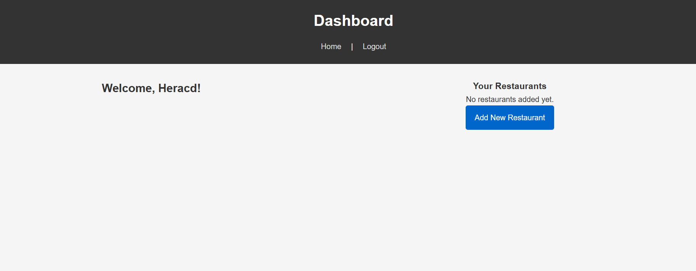

# 🗺️ Afghanistan District Guessing Game

This is a Node.js + Express web application that connects to a PostgreSQL database to run a province-guessing game based on Afghanistan’s districts. Users are shown a random district and must guess the correct province. The app keeps score and offers hints based on regions.



## Here’s a **refactored `README.md`** based on your code and its functionality:

## 🚀 Features

- Express server setup with EJS templating
- PostgreSQL connection using `pg`'s `Pool` for efficient querying
- Fetches district data from the `"Districts"` table
- Province guessing logic with score tracking
- Optional region-based hints
- Game over and reset functionality
- Basic frontend styling via static CSS

---

## 🧠 How the Game Works

1. A random district is selected from the database.
2. The user must input the correct province for that district.
3. If correct → score increases.
4. If incorrect → score decreases.
5. If the score falls below 0 → redirected to the game over screen.
6. Hint button reveals the region for the current district.

---

## 🛠️ Setup & Installation

1. **Clone the repository:**

```bash
git clone https://github.com/your-username/afghanistan-district-game.git
cd afghanistan-district-game
```

2. **Install dependencies:**

```bash
npm install
```

3. **Set up PostgreSQL database:**

Create a table named `"Districts"` with the following columns:

```sql
CREATE TABLE "Districts" (
  id SERIAL PRIMARY KEY,
  region TEXT,
  province TEXT,
  district TEXT
);
```

Then, populate it with data.

4. **Configure database connection:**

Update this section in `index.js` with your credentials:

```js
const pool = new Pool({
  user: "postgres",
  host: "localhost",
  database: "Afghanistan",
  password: "your_password",
  port: 5432,
});
```

5. **Run the app:**

```bash
node server.js
```

Then open [http://localhost:3000](http://localhost:3000) in your browser.

---
